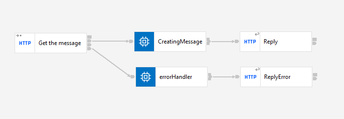
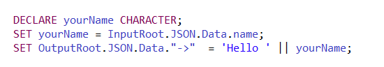
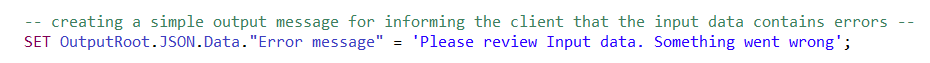

# Description

`HelloWorld_ErrorHandler` application is a demonstration of the possibilities of working on the IBM ACE bus version 12.0.5. It does not execute business functionality. 

The application receives data from client, and then returns "Hello"  + {*yourName*} string to the client in .json format and provides the following endpoint:

**`/acehelloworld/v3:`**

Using a *POST* method, it sends a data to the application and receives in response a string "Hello" + yourName. If the input data contains errors, the application sends an **error message** to the client through the error handling track. 

# Implementation

**`HelloWorld_ErrorHandler`**

The `Get the message` - HTTP Input node - receives the request with data containing a json object with key and value. The `CreatingMessage` compute node creates the message tree and message body:

 Finally, `Reply` sends the message to the client.

 If the input data contains errors, the application sends an **error message** to the client through `errorHandler` compute node to HTTP reply `ReplyError`:

 

 # Format

 The app uses .json 